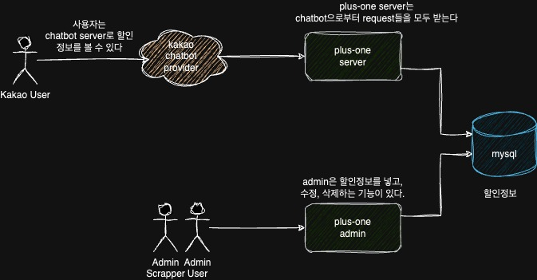

# plus-one

편의점을 갈때에 1+1이나 2+1 제품들을 평소 구매하는 편인데,
카카오톡 챗봇 알림으로 매주 편의점의 할인 정보를 알려줬으면 좋겠어서 만들어보는 토이프로젝트

# 사용자 시나리오

1. 편의점 할인 정보 등록
2. 편의점 할인 정보 조회
3. 편의점 할인 정보 목록
4. 편의점 할인 정보 수정
5. 편의점 할인정보 매주 카카오톡 챗봇으로 알려주는 기능

# 프로젝트 아키텍쳐

https://drive.google.com/file/d/1Y0tOJT6I4QwZ7Qh6D_fpsaps3uXAg7RA/view?usp=sharing




# API 명세서 정의

[docs/api.http](docs/api.http) 파일 참고

# 프로젝트 실행방법

``` bash
docker-compose up --build -d

`IntelliJ에서 .env 파일을 읽고, SpringApplication의 main실행시키기
```
